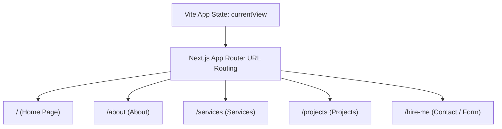

# Phase-Wise Migration Plan: Next.js App Router, Docker, Email Service & CI/CD

This document details the step-by-step roadmap to migrate the portfolio repository from a Vite-based single-page application to a Next.js App Router structure, including containerization, backend email integration, and an automated CI/CD pipeline.

---

## Phase 1: Project Initialization & Structure Set Up
### Objective
Initialize the Next.js workspace and copy existing static assets.

1. **Next.js Boilerplate**:
   - Initialize Next.js with App Router, TypeScript, and Tailwind CSS.
2. **Move Configurations**:
   - Align package.json dependencies, custom fonts, icons, and tailwind/Vite configurations.
   - Maintain the custom CSS styling (including Material Symbols and theme variables from `src/index.css`).
3. **Migrate Static Assets**:
   - Copy JSON files (`data/projects.json`, `data/services.json`, etc.) and image resources into the `public/` directory of the Next.js project.

---

## Phase 2: Routing & UI Component Porting
### Objective
Replace the state-based view switching (`currentView` in React) with Next.js App Router URLs while keeping the UI visual presentation identical.

1. **Global Shell (`layout.tsx`)**:
   - Replicate the header, sidebar, footer, and background grid lines globally.
   - Load the font declarations (`Archivo Narrow`, `Inter`, `Material Symbols`) using `next/font/google` or standard link tags.
2. **Navigation Updates**:
   - Replace state-triggered view switches (`onChangeView('about')`) with standard Next.js `<Link href="/about">` elements.
   - Use `usePathname()` in navigation headers to highlight the active menu link.
3. **Page Porting**:
   - Port view panels to corresponding folders:
     - `src/components/HomeView.tsx` -> `src/app/page.tsx`
     - `src/components/AboutView.tsx` -> `src/app/about/page.tsx`
     - `src/components/ServicesView.tsx` -> `src/app/services/page.tsx`
     - `src/components/ProjectsView.tsx` -> `src/app/projects/page.tsx`
     - `src/components/HireMeView.tsx` -> `src/app/hire-me/page.tsx`

---

## Phase 3: Email Service Integration (Backend)
### Objective
Set up a secure server-side handler for the Contact Form.

1. **Email Provider Setup**:
   - Select an email delivery service (e.g., **Resend**, **SendGrid**, or **Nodemailer** using Gmail SMTP).
2. **Next.js Server Actions / API Route**:
   - Implement a POST API route (`src/app/api/contact/route.ts`) or a Next.js Server Action (`src/app/actions.ts`) to parse the form body and send the email.
3. **Form Refactoring**:
   - Update the `<form>` inside `/hire-me` page to call the API endpoint/Action, providing user feedback (loading state, success state, error message).
4. **Environment Configuration**:
   - Maintain keys (e.g. `SMTP_HOST`, `EMAIL_API_KEY`, `TO_EMAIL`) inside a `.env.local` file (non-commited).

---

## Phase 4: Dockerisation
### Objective
Containerize the Next.js application using a multi-stage docker image for production efficiency.

1. **Production Dockerfile**:
   - Create a multi-stage `Dockerfile` to compile the app and run it in a lightweight Node.js alpine runner:
     - **Stage 1 (deps)**: Installs npm packages.
     - **Stage 2 (builder)**: Runs `next build`.
     - **Stage 3 (runner)**: Standard minimal setup running `next start` on port 3000.
2. **Docker Ignore**:
   - Define a `.dockerignore` file to ignore `node_modules`, `.next`, and logs.
3. **Docker Compose**:
   - Add a `docker-compose.yml` configuration for quick local testing of container builds.

---

## Phase 5: CI/CD Pipeline (Build, Test, Deployment)
### Objective
Set up an automation workflow on push/PR events.

1. **CI Pipeline (GitHub Actions or GitLab CI)**:
   - **Workflow Events**: Triggered on push to `main` branch.
   - **Steps**:
     - Check out the repository.
     - Cache package manager dependencies.
     - Run TypeScript compiler (`tsc --noEmit`).
     - Run Linter (`eslint`).
     - Execute Next.js build verification.
2. **Automated Docker Image Build**:
   - Push compiled/tested image to Docker Hub or Github Container Registry (GHCR).
3. **Automatic Deployment**:
   - Set up Webhook / SSH runners to automatically pull the new Docker container and restart the container service on the hosting server (Render, AWS ECS, VPS, Coolify, or Dokku).
